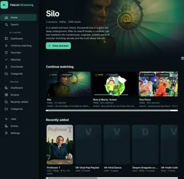
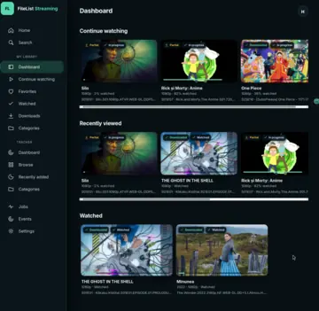
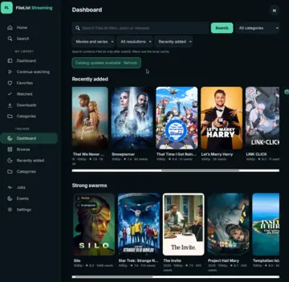
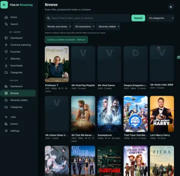
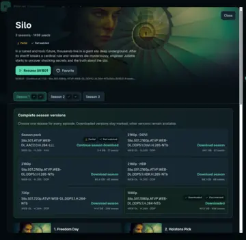
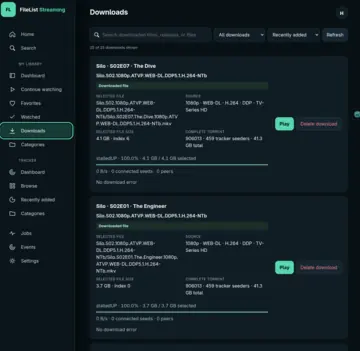
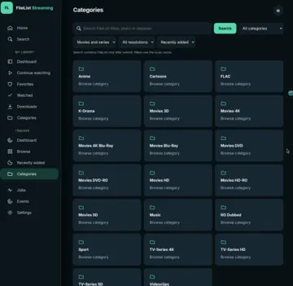
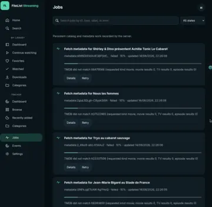

# FileList Streaming Service

A self-hosted Go media server, responsive web application, and Samsung Tizen TV client for browsing FileList and playing media managed by qBittorrent. It is designed for a trusted private LAN and a small server such as a Raspberry Pi 4.

Version **0.2.7** adds one-command Docker deployment, safe complete-season controls, and automatic Tizen server discovery. Progressive HTTP Range playback from an incomplete qBittorrent download is server-verified; physical Samsung AVPlay verification below 100% remains pending.

## Features

- Browse the locally cached FileList catalog by dashboard, recent additions, category, filter, sort, pagination, or explicit tracker search without making routine pages depend on FileList availability.
- Canonical movie and series pages group seasons and episodes instead of scattering duplicate episode cards across dashboards.
- Complete-season releases expand before any action is taken. Download, pause, resume, retry, and protected deletion happen from explicit controls, while each downloaded pack file appears under its matching episode.
- Download management shows accurate selected-file and complete-torrent sizes, live progress/speed/peer state, stable in-place updates, search, filters, sorting, and one action that removes the torrent and its files.
- A playback strategy automatically chooses a completed local file or an incomplete qBittorrent-backed progressive stream. Existing local playback does not require another FileList lookup.
- qBittorrent sequential download and first/last-piece priority are applied per managed incomplete torrent. No production or global download speed cap is configured.
- Resume a movie or series at the saved episode and position, then automatically advance to the next episode. Favorites, history, progress, and watched state are shared between web and TV.
- Prefer English audio and Romanian subtitles with English fallback. Track choices are remembered per file; embedded/torrent subtitles and cached SubDL downloads are reused.
- Browser playback exposes audio selection and can convert audio to AAC while copying video unchanged. Tizen uses native AVPlay direct playback, so the Raspberry Pi never transcodes video.
- TV-first spatial navigation covers dialogs, season packs, download controls, settings, and playback. First launch can discover compatible servers on the local subnet or retain a manually entered address.
- Run the server and qBittorrent in isolated ARM64-compatible containers. The wrapper preserves existing qBittorrent credentials, backs up its config on every start, and merges only credential-free storage/streaming policy.
- Deploy from source, a precompiled GitHub release, Docker Compose, or the remembered Raspberry Pi deployment workflow. Normal builds install no packages on the workstation.

## Screenshots

Select a thumbnail to open the optimized full-size image.

<table>
  <tr>
    <td align="center"><a href="docs/img/homepage-preview.webp"></a><br><sub>Home and continue watching</sub></td>
    <td align="center"><a href="docs/img/my-lib-dashboard-preview.webp"></a><br><sub>My Library dashboard</sub></td>
  </tr>
  <tr>
    <td align="center"><a href="docs/img/tracker-dashboard-preview.webp"></a><br><sub>Tracker dashboard</sub></td>
    <td align="center"><a href="docs/img/browse-preview.webp"></a><br><sub>Browse and filter</sub></td>
  </tr>
  <tr>
    <td align="center"><a href="docs/img/tv-show-preview.webp"></a><br><sub>Series, seasons, and episodes</sub></td>
    <td align="center"><a href="docs/img/downloads-preview.webp"></a><br><sub>Download management</sub></td>
  </tr>
  <tr>
    <td align="center"><a href="docs/img/categories-preview.webp"></a><br><sub>Categories</sub></td>
    <td align="center"><a href="docs/img/jobs-preview.webp"></a><br><sub>Background jobs</sub></td>
  </tr>
</table>

The README uses 360 px WebP thumbnails and optimized WebP full views so the gallery stays lightweight while retaining readable full-size screenshots.

## Documentation

| Guide | Contents |
| --- | --- |
| [Installation and upgrades](docs/INSTALLATION.md) | Docker Compose, credential/API-key acquisition, automated and manual installs, GitHub release artifacts, Raspberry Pi deployment, backup, rollback, and Tizen installation. |
| [User guide](docs/USER_GUIDE.md) | Browsing, season packs, downloads, playback, resume, subtitles, TV operation, and troubleshooting. |
| [Configuration reference](docs/CONFIGURATION.md) | Settings, paths, limits, language preferences, and provider configuration. |
| [Tizen guide](docs/TIZEN.md) | Build, signing, Developer Mode, Apps2Samsung installation, D-pad behavior, and physical-TV verification. |
| [Subtitle architecture](docs/SUBTITLES.md) | Existing subtitle discovery, preparation, selection, storage, and playback behavior. |
| [API reference](docs/API.md) | HTTP endpoints and response contracts for clients and integrations. |
| [Architecture](docs/ARCHITECTURE.md) | Boundaries, domain model, adapters, storage, streaming, and client structure. |
| [Development](docs/DEVELOPMENT.md) | Build/test workflows, integration testing, checkpoints, and implementation notes. |
| [Known issues](docs/KNOWN_ISSUES.md) | Remaining limitations and physical-device verification items. |
| [Maintainer notes](docs/MAINTAINER_NOTES.md) | Release, operational, dependency, security, and deployment invariants. |
| [Security policy](SECURITY.md) | Supported versions, reporting, and deployment security boundaries. |

## Local quick start

```bash
go test ./...
go run ./cmd/server
```

Open `http://127.0.0.1:8097`, enter FileList and qBittorrent settings, and save them. Runtime settings are stored in `data/settings.json` with mode `0600`. Browser Settings includes dependency-specific Test buttons and copyable field help. The repository `.env` is for developer diagnostics only and is never read by the application.

The default trusted networks are loopback and RFC1918 private address ranges. Narrow them in Settings when practical. Do not expose this no-login service to the internet.

## Docker

Docker Compose runs the server and a credential-free qBittorrent sidecar from one private `.env.docker` file. Create it with `make docker-configure`, check it with `make docker-validate`, and start with `make docker-up`. Every variable is documented in the [Docker environment reference](docs/DOCKER_ENV.md).

## Frontend and TV package

`make frontend` builds and tests the browser and Tizen clients in Docker, then creates and validates the unsigned Apps2Samsung artifact at `clients/tizen/.build/artifacts/FileListTV-0.2.7.wgt`. Apps2Samsung signs it for the selected TV during installation. See [the Tizen build and installation guide](docs/TIZEN.md), including the living physical-TV verification log.

## Raspberry Pi deployment

`make deploy-pi PI_HOST=user@server.lan` cross-compiles the ARM64 server, then prompts for the server and non-secret qBittorrent/application paths. Answers are remembered in ignored `deploy/.deploy.local.conf`. Every run creates a new protected qBittorrent config backup, merges only the credential-free streaming template, and restores both qBittorrent configuration and the previous application binary if deployment fails. The target operation uses `sudo` and therefore requires explicit approval.

## Server dependencies and fresh-machine setup

| Dependency | Required for | Installation/runtime notes |
| --- | --- | --- |
| Linux with systemd | Daemon isolation and restart | Raspberry Pi OS/Debian/Ubuntu, Fedora/RHEL/Rocky/Alma, Arch, and openSUSE package families are supported. |
| qBittorrent-nox | Torrent ownership, priority, progress, files | Fresh setup binds the Web UI to `127.0.0.1:8080` and uses `/srv/filelist-downloads`. |
| FFmpeg and ffprobe | Embedded subtitle probing/extraction and browser audio compatibility | Video is never transcoded. Desktop-browser fallback converts incompatible audio to AAC; Tizen stays direct-play. Paths are browser-configurable. |
| SQLite | Catalog, jobs, playback, ratings, subtitle associations | Embedded through the pure-Go driver; no system SQLite package is required. |
| Exact Go version in `go.mod` | Fresh-clone server build | Installed as a private verified toolchain; system Go is not replaced. |
| CA certificates, curl, tar | Verified toolchain download | Used only for setup/build and HTTPS trust. |
| logrotate | Server log retention | Rotates daily or at 10 MiB and keeps 14 compressed generations. |
| Node.js | Not required at runtime | Frontend builds use the pinned Docker image; assets are embedded in the Go binary. |

For a fresh cloned server only, preview the operation before approving it:

```bash
sudo sh deploy/bootstrap-server.sh --confirm-server-install --dry-run
sudo sh deploy/bootstrap-server.sh --confirm-server-install
```

The idempotent script supports `apt`, `dnf`, `pacman`, and `zypper`. It never changes firewall rules or writes tracker/provider secrets. It creates dedicated service users, configures qBittorrent and the application services, verifies the official Go archive SHA-256, builds locally, and prints the qBittorrent temporary-password journal command. Routine `make deploy-pi` stays package-install-free. Do not run this bootstrap on a workstation or an already configured production Pi.

## Safety boundaries

- No host package installation is part of a normal build.
- Project dependencies are downloaded by Go or pinned build containers.
- Pi service/user/group installation and Tizen device changes require explicit approval.
- A real FileList torrent is never selected automatically for tests.
- Only server-owned torrents persisted in SQLite are exposed in the management UI.

## CI, security, and releases

Every push to `master` runs Go tests/race/vet, browser and TV compiler/tests, WGT validation, and packaging tests. A separate security workflow runs Gitleaks, govulncheck, Trivy, CodeQL, actionlint, Zizmor, and pull-request dependency review; Dependabot checks Go, npm, Actions, and Docker dependencies weekly.

`VERSION` is the single release version. A matching `v<VERSION>` tag builds and publishes Linux amd64/arm64/armv7, Windows amd64, macOS amd64/arm64, and an unsigned Apps2Samsung WGT. Releases also contain SHA-256 checksums, CycloneDX/SPDX SBOMs, and build-provenance attestations. See [maintainer notes](docs/MAINTAINER_NOTES.md) and [security policy](SECURITY.md).
